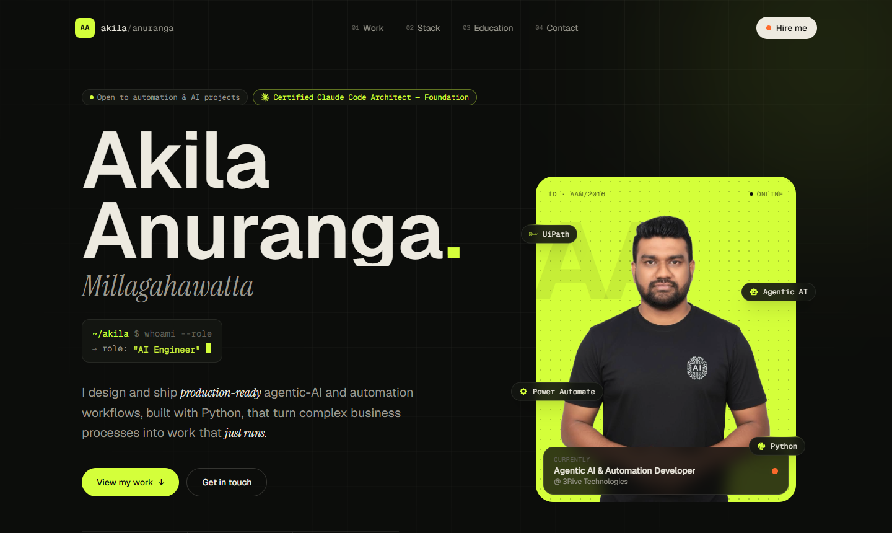

<div align="center">

<a href="https://akilaanuranga.github.io/akila-anuranga/">
  
</a>

# Akila Anuranga Millagahawatta

**Agentic AI & Automation Developer** · Colombo, Sri Lanka 🇱🇰

*I design and ship production-ready agentic-AI and automation workflows, built with Python,<br/>that turn complex business processes into work that just runs.*

[](https://akilaanuranga.github.io/akila-anuranga/)
[](https://www.credly.com/badges/13f9a30b-f491-4763-bd9e-d890684706b9)

[](https://linkedin.com/in/akila-anuranga)
[](https://github.com/AkilaAnuranga)
[](mailto:anurangaakila@gmail.com)
[](https://wa.me/94770534618)

</div>

---

```console
~/akila $ whoami --verbose
→ name      Akila Anuranga Millagahawatta
→ role      Agentic AI & Automation Developer @ 3Rive Technologies
→ focus     AI agents · Python · UiPath · Power Automate · Claude Code
→ shipping  since 2016 (10+ years)
→ based in  Colombo, Sri Lanka (GMT+5:30)
→ status    open to automation & AI projects
```

## 🏅 Certification

<table>
  <tr>
    <td width="72" align="center">
      
    </td>
    <td>
      <b>Claude Code Architect — Foundation</b> · <i>Anthropic</i><br/>
      Certified in designing and building agentic AI systems and workflows with Claude Code.<br/>
      <a href="https://www.credly.com/badges/13f9a30b-f491-4763-bd9e-d890684706b9">✓ Verify credential on Credly ↗</a>
    </td>
  </tr>
</table>

## 💼 Experience

```console
~/akila $ git log --oneline --career
```

### ● Agentic AI & Automation Developer — 3Rive Technologies
`HEAD → current` · *Jul 2025 — Present*

Design, build, and maintain production-ready agentic AI and automation solutions that automate complex end-to-end business workflows. Deliver scalable, enterprise-grade automation using Python, UiPath and Power Automate, with AI agents handling intelligent document processing and decision-making.

`Agentic AI` `Python` `UiPath` `Power Automate` `Power Apps`

### ○ Senior Software Engineer — Aspirations I-Lab
`merged` · *May 2024 — Jul 2025*

Led development and deployment of AI-driven bots across WhatsApp, Telegram, and Messenger. Architected multi-platform automation pipelines and NLP-powered conversational workflows for enterprise clients.

`Python` `Node.js` `WhatsApp API` `NLP`

### ○ Software Engineer — DartXTool
`merged` · *Oct 2016 — Feb 2024*

Led full-stack development of DartXTool — a flagship SEO monitoring and optimization platform leveraging Google Search Console data. Built robust data pipelines, real-time dashboards, and automated reporting systems.

`React` `PHP` `Laravel` `Google API`

## 🧱 The Stack — layer by layer

| Layer | | Technologies |
|:--|:--|:--|
| **L5** | **Agentic AI & Automation** |       |
| **L4** | **Application** |            |
| **L3** | **Content & Commerce** |     |
| **L2** | **Data** |     |
| **L1** | **Infrastructure** |     |

## 🎓 Education

| | Qualification | Institution | Period |
|:--|:--|:--|:--|
| **3.52** GPA | Bachelor of Engineering in Software Engineering | IIC University of Technology — Phnom Penh, Cambodia | 2016 — 2020 |
| **171** credits · SCQF L7 | Professional Diploma in Software Engineering | JAVA Institute for Advanced Technology — Sri Lanka | 2014 — 2016 |

```console
~/akila $ tail -f learning.log
● rpa-process-automation   UiPath, Power Automate
● agentic-ai               LLM workflows & AI agents
● cloud                    Azure, AWS, GCP
● modern-web               React, Next.js, Node.js
◌ watching for new tech_
```

---

## 🖥️ About this repository

This repo is the source of my portfolio site, live at **[akilaanuranga.github.io/akila-anuranga](https://akilaanuranga.github.io/akila-anuranga/)**.


**Design — "The Stack".** A dark, tech-stack-inspired theme (carbon black, acid lime, signal orange) set in Geist, Geist Mono and Instrument Serif. Experience is rendered as a `git log` commit graph, skills as an interactive isometric layer diagram, and the hero as a `whoami` terminal. Fully responsive and respects `prefers-reduced-motion`.

### Run locally

```bash
npm install
npm run dev        # http://localhost:3000/akila-anuranga/
```

### Deploy

```bash
npm run deploy     # builds to dist/ and publishes it to the gh-pages branch
```

### Project structure

```
src/
├── data/profile.ts        # ← all content: roles, experience, stack, education, certifications
├── components/
│   ├── Header.tsx         # floating nav with active-section tracking
│   ├── Hero.tsx           # name, whoami terminal, portrait card
│   ├── Marquee.tsx        # scrolling tech ticker
│   ├── Experience.tsx     # git-log style timeline
│   ├── Skills.tsx         # isometric stack diagram + layers
│   ├── Education.tsx      # certification, degrees, learning log
│   ├── Contact.tsx        # command-style contact panel
│   ├── Footer.tsx
│   └── ui.tsx             # shared Reveal / SectionHeading / icons
├── index.css              # Tailwind v4 theme tokens
└── App.tsx                # SEO meta + page composition
```

To update anything on the site, edit **`src/data/profile.ts`** — the components read from it.

---

<div align="center">

**[Visit the website ↗](https://akilaanuranga.github.io/akila-anuranga/)** · **[Let's talk](mailto:anurangaakila@gmail.com)**

<sub>Designed & built by Akila Anuranga Millagahawatta · Colombo, Sri Lanka</sub>

</div>
